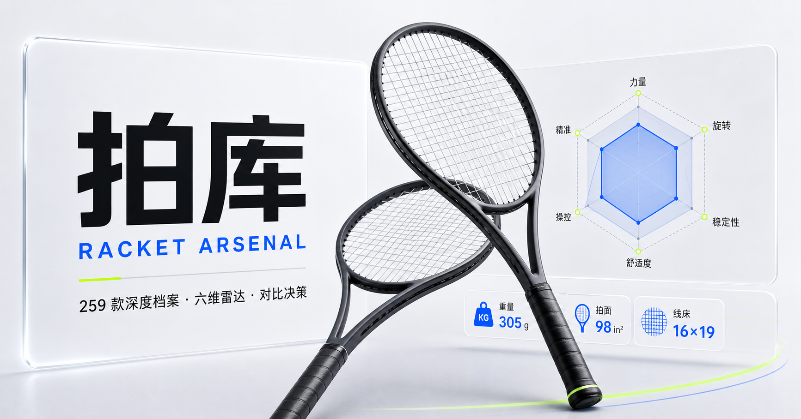

# 拍库 RACKET ARSENAL

中文网球拍选购指南：11 个品牌、259 款官网核验型号，从「处方问卷」到「决策室对比」，帮你在不试打之前把功课做透。




## ✨ 功能特性

单页应用，五大页签，全部功能无需登录。

v0.7.0 将球星页升级为人物主导的编辑型拍房：16 位 ATP / WTA 球星均有真实照片、打法侧写、映射等级、个性化零售拍适配分和可继续进入拍库的决策路径。

### 发现

- **拍库严选榜单**：由 `criteria` 单一事实源自动筛选生成，入选标准公开、可复算（v0.5.0）
- **个性化推荐**：基于处方答案的首页推荐位
- **最近浏览货架**：最近看过的型号快速回访，数据仅存本机（v0.5.0）

### 处方

- **3 步换拍处方问卷**：阶段 → 打法 → 优先项，可选当前用拍作为基准
- **推荐评分拆解**：每张结果卡可展开「为什么是它」，基础分 / 阶段 / 打法 / 优先项逐项透明，未命中如实显示 +0（v0.5.0）
- **侧重秒切预览**：七个优先项胶囊即时重算榜单并显示名次变化徽标，不落盘、不改答案（v0.5.0）
- **球星同频指数**：与 16 位球星用拍的打法同频度，支持 `#tour/player/{id}` 深链（v0.5.0）
- 打法答案默认不出本机

### 球拍库

- 品牌 → 拍系 → 型号三级浏览，支持搜索与多维筛选
- 型号深度档案：六项官网核验规格 + 六维雷达 + 规格洞察 + 购买链接
- **相似平替查找**：档案页按五维归一化规格距离找出 3 把他牌平替（v0.5.0）

### 球星（Tour Locker）

- ATP + WTA 各 Top 8，共 16 名球星的用拍映射
- **真实球星照片**：16 张本地化人物照，逐卡展示 Wikimedia Commons 作者与许可（v0.7.0）
- **打法与选拍路径**：球员侧写、三项打法标签、个性化关联拍适配分、排名头像快速定位（v0.7.0）
- **诚实映射**：明确区分品牌公开关联、拍库可比较落点和型号级 / 系列级 / 等效 / 参考等级（v0.7.0）
- 每条映射标注四档可信度（型号级映射 / 系列级映射 / 基础型号等效 / 当前拍系参考）

### 决策室

- 最多 3 把球拍对比：叠加六维雷达 + 规格对照表 + 试打记录
- **对比白话解读**：「差异翻译」把规格差转成白话结论，未公开参数如实排除并注明（v0.5.0）
- **好友球拍对决**：`vs=1` 分享深链，1v1 逐维「领先 / 战平」徽章与六维战报比分（v0.5.0）

### 工程侧（v0.5.0）

- **购买链接体检**：`npm run links:check` 巡检全部 259 条官网购买链接，产出三态健康 manifest（`app/purchase-link-health.json`），测试守护 `broken === 0`

## 🧭 数据诚实原则

这是产品灵魂，所有功能共同遵守：

- **不虚构规格**：官网未公开的参数显示「官网未公开」，不猜测、不留白、不臆造
- **评分定性**：六维评分与匹配指数全部标注「拍库相对评估，非实验室测量」
- **球星映射分档**：每条球星用拍映射标注四档可信度，比赛拍与零售拍的差异如实注明
- **相似 ≠ 等价**：平替结果固定提示「规格相似不等于手感等价，不替代实际试打」
- **隐私默认**：无登录全功能，处方答案与浏览记录只存本机；hash 深链全部可分享

## 🏗 技术架构

| 层 | 选型 | 说明 |
| --- | --- | --- |
| 框架 | Next.js 16 + React 19 | 经 [vinext](https://github.com/cloudflare/vinext)（Cloudflare 官方 Vite 运行时）构建 |
| 托管 | Cloudflare Workers | OpenAI Sites 托管，`worker/index.ts` 为入口 |
| 数据 | 100% 静态编译期 TS/JSON | 无数据库、无登录、无后端 API，`app/*-data.ts` 即数据源 |
| 路由 | 自研 hash 路由 + 历史栈 | `app/navigation-state.ts`：五页签、深链解析、脏参数 canonical 化 |
| 样式 | 手写 CSS 设计系统 | `app/globals.css` 7500+ 行 iOS 风格样式，明暗双主题（Tailwind 已装但未承载设计系统） |
| 平台集成 | `app/chatgpt-auth.ts` | Sign in with ChatGPT 预置能力，当前产品无登录功能、未启用 |

主视图集中在 `app/page.tsx`，纯函数逻辑（推荐引擎、对比解读、相似度等）拆分为独立模块，便于零框架单测直接导入。

## 📊 数据规模

| 维度 | 数量 | 说明 |
| --- | --- | --- |
| 品牌 | 11 | 每家含官网域名、logo 来源与核验日期 |
| 拍系 | 49 | 含世代、类型、发布年份 |
| 型号 | 259 | 每款 6 项官网核验规格 + 购买链接 |
| 官网商品图 | 759 | `public/rackets/models/` 按品牌归档 |
| 球星 | 16 | ATP + WTA 各 Top 8 用拍映射 |
| 购买链接健康 manifest | 259 条 | `links:check` 生成，测试守护零失效 |

## 🚀 快速开始

前置要求：Node.js `>=22.13.0`

```bash
npm install
npm run dev
```

| 命令 | 作用 |
| --- | --- |
| `npm run dev` | 本地开发 |
| `npm run build` | vinext 构建产物 |
| `npm run start` | 本地预览构建产物 |
| `npm test` | 先 `vinext build`，再跑全部 179 个用例 |
| `npm run lint` | ESLint 检查 |
| `npm run links:check` | 巡检 259 条购买链接，更新 `app/purchase-link-health.json` |
| `npm run images:sync` | 同步官网商品图到 `public/rackets/` 并生成图片清单 |
| `npm run db:generate` | 生成 Drizzle 迁移（脚手架预留，当前无数据库） |

## 🧪 测试体系

32 个零框架测试文件、179 个用例（`node:test` + `tsx`），四层策略：

1. **SSR 冒烟**：构建产物渲染 HTML 断言（`rendered-html.test.mjs` 等）
2. **纯函数单测**：推荐引擎、对比解读、相似度、状态机等模块直接导入断言
3. **源码即规格**：正则断言源码中的无障碍属性与关键文案（配合 `.prettierignore` 全仓库禁用 Prettier，防止格式化破坏规格断言）
4. **资产校验**：sharp 校验商品图尺寸与格式、品牌资产完整性、链接健康 `broken === 0`

## 📁 目录结构

```
app/
  page.tsx               # 五页签主视图
  globals.css            # 手写 iOS 风格设计系统（明暗双主题）
  navigation-state.ts    # 自研 hash 路由与历史栈
  catalog-data.ts        # 11 品牌 / 49 拍系 / 259 型号数据源
  racket-profiles.ts     # 深度档案与六维评分
  prescription-engine.ts # 处方推荐引擎
  compare-insights.ts    # 对比白话解读
  similar-rackets.ts     # 相似平替查找
  tour-data.ts           # 16 位球星用拍映射（四档可信度）
  honesty-notes.ts       # 数据诚实文案单一来源
scripts/
  check-purchase-links.mjs   # 购买链接体检
  sync-catalog-images.mjs    # 官网商品图同步
tests/                   # 32 个零框架测试文件（179 用例）
public/rackets/models/   # 759 张官网商品图（按品牌归档）
worker/index.ts          # Cloudflare Workers 入口
```

## 📝 版本历史

详见 [CHANGELOG.md](./CHANGELOG.md)。

## 📄 开发文档

设计与需求文档见 [docs/plans/](./docs/plans/)，如 v0.5.0 九项功能的需求定稿：[2026-07-18-s-tier-quick-wins-design.md](./docs/plans/2026-07-18-s-tier-quick-wins-design.md)。
